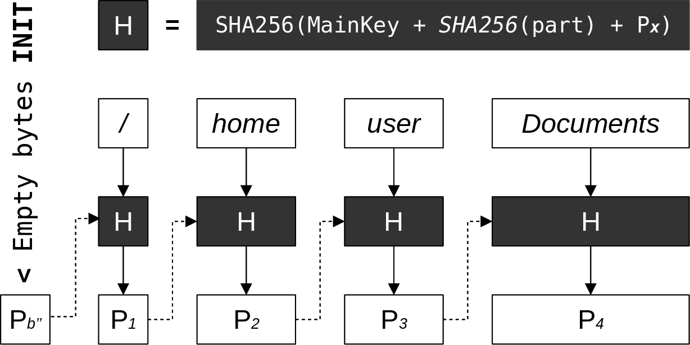

LocalBox
========

The *LocalBox* is a `SQLite Database <https://en.wikipedia.org/wiki/SQLite>`_ and a place where we store *Metadata* of pushed to :doc:`remotebox` *Files*.

.. note::
   :class:`~tgbox.api.local.DecryptedLocalBox` can be fully restored from :class:`~tgbox.api.remote.DecryptedRemoteBox`.

Tables
------

*LocalBox* has four tables: *BOX_DATA*, *FILES*, *PATH_PARTS* and *DEFAULTS*.

BOX_DATA
^^^^^^^^

*BOX_DATA* store information about *Box*, *Session*, etc.

============== =========== ======== ========= ======= ====== ======== =======================
BOX_CHANNEL_ID BOX_CR_TIME BOX_SALT MAINKEY   SESSION API_ID API_HASH FAST_SYNC_LAST_EVENT_ID
============== =========== ======== ========= ======= ====== ======== =======================
BLOB           BLOB        BLOB     BLOB|NULL BLOB    BLOB   BLOB     BLOB
============== =========== ======== ========= ======= ====== ======== =======================

- ``BOX_CHANNEL_ID`` -- *Encrypted RemoteBox (Telegram channel) ID*
- ``BOX_CR_TIME`` -- *Encrypted LocalBox creation time*
- ``BOX_SALT`` -- *BoxSalt for MainKey creation*
- ``MAINKEY`` -- *Encrypted by BaseKey MainKey. Used if RemoteBox was cloned*
- ``SESSION`` -- *Encrypted by BaseKey Telethon's StringSession*
- ``API_ID`` -- *Encrypted by MainKey your API_ID from the my.telegram.org site*
- ``API_HASH`` -- *Encrypted by MainKey your API_HASH from the my.telegram.org site*
- ``FAST_SYNC_LAST_EVENT_ID`` -- *Last found on the fast syncing event ID*

FILES
^^^^^

*FILES* store information about uploaded to the *RemoteBox* files.

================ =========== ========== ========= ======== ================
ID {PRIMARY_KEY} UPLOAD_TIME PPATH_HEAD FILEKEY   METADATA UPDATED_METADATA
================ =========== ========== ========= ======== ================
INT              BLOB        BLOB       BLOB|NULL BLOB     BLOB|NULL
================ =========== ========== ========= ======== ================

.. note::
    - ``ID`` is a Telegram message ID. **Must** be unique as any SQLite *PrimaryKey*
    - ``PPATH_HEAD`` is a path PartID of the last part (folder). See a ":ref:`How does we store file paths`"
    - ``FILEKEY`` will be not ``NULL`` only when you import *RemoteBox File* from other's :doc:`remotebox`. In this case it will be encrypted by :class:`~tgbox.keys.MainKey`
    - We take ``METADATA`` plus *File IV* from the *RemoteBox File* and place it to the *LocalBox* without changing anything
    - ``UPDATED_METADATA`` is a user changes of ``METADATA``, encrypted and packed with the *PackedAttributes* algorithm (see :doc:`protocol`)

DEFAULTS
^^^^^^^^

*DEFAULTS* store some of the default TGBOX values

============ ============= ============= ============= ==============
METADATA_MAX FILE_PATH_MAX DOWNLOAD_PATH DEF_NO_FOLDER DEF_UNK_FOLDER
============ ============= ============= ============= ==============
INTEGER      INTEGER       TEXT          TEXT          TEXT
============ ============= ============= ============= ==============

.. note::
   - ``METADATA_MAX`` is the bytesize limit of the TGBOX file metadata
   - ``FILE_PATH_MAX`` is the bytesize limit of the file path
   - ``DOWNLOAD_PATH`` is the default download path
   - ``DEF_NO_FOLDER`` is the default folder when file path is not specified on uploading/importing
   - ``DEF_UNK_FOLDER`` is the default folder to which files will be placed on download if ``hide_folder`` is ``True``

PATH_PARTS
^^^^^^^^^^

*PATH_PARTS* store every path part in encrypted form with their IDs.

======== ===================== ==============
ENC_PART PART_ID {PRIMARY_KEY} PARENT_PART_ID
======== ===================== ==============
BLOB     BLOB                  BLOB|NULL
======== ===================== ==============

.. note::
   - ``ENC_PART`` is an encrypted by :class:`~tgbox.keys.MainKey` *Path Part*
   - ``PART_ID`` is *Path Part ID* (see :ref:`How does we store file paths`)
   - ``PARENT_PART_ID`` is a *Part ID* of *Parent path* (see :ref:`How does we store file paths`)

How does we store file paths
----------------------------

Every file in TGBOX (as well as in any OS) must have a *file path*. TGBOX *should* accept any path that `pathlib.Path <https://docs.python.org/3/library/pathlib.html#basic-use>`_ can support: the UNIX-like and Windows-like. So, let's imagine that we have an abstract file called *file.txt*. It's absolute (Unix-like) path will be ``/home/user/Documents``. The *RemoteBox File* will store its path in a *File Metadata* as is. However, in the *LocalBox* we will store it more efficiently, in a Blockchain-like way.

|

|

In this schema we split a *File path* by parts (*/*, *home*, *...*). A path anchor (*/* in UNIX and i.e *C:\\* on Windows) is also considered a *Path Part*. Our goal here is to create a **unique** *ID* for each *Path Part*, and we complete it by **hashing** string concated from :class:`~tgbox.keys.MainKey`, *SHA256* of *Path Part* (i.e *user*) and *Parent Part ID* (in this schema, the *Parent Part ID* is *Px*). For a first *Path Part* we use empty bytestring (``b''`` as *P₀*), as there is currently no parent.

.. admonition:: *Path Part ID generator* in Python code
    :class: dropdown

    .. code-block:: python

        ... # Some code was omitted

        def ppart_id_generator(path: Path, mainkey: MainKey) -> Generator[tuple, None, None]:
            """
            This generator will iterate over path parts and
            yield their unique IDs. We will use this to better
            navigate over *abstract* Folders in the LocalBox.

            The path **shouldn't** contain a file name,
            otherwise directory will contain it as folder.

            */home/user/* is **OK**
            */home/user/file.txt* is **NOT**

            Will yield a tuple (PART, PARENT_PART_ID, PART_ID)
            """
            parent_part_id = b'' # The root (/ anchor) doesn't have parent
            for part in path.parts:
                part_id = sha256(
                    mainkey\
                  + sha256(part.encode()).digest()\
                  + parent_part_id
                )
                yield (part, parent_part_id, part_id.digest())
                parent_part_id = part_id.digest()

    .. tip::
        See it in a ``tools`` module: :func:`tgbox.tools.ppart_id_generator`.

Additionally, we encrypt the *Path Part* with a :class:`~tgbox.keys.MainKey` and store it with *Part ID (Px)* and *Parent Part ID (Px-1)* in a ``PATH_PARTS`` table of *LocalBox* SQLite *Database*. In the default :doc:`protocol` behaviour this process is initiated after user pushed file to *RemoteBox*, on saving *Metadata* to *LocalBox*. We make a *Path Part IDs* and insert data into ``PATH_PARTS`` table if it's not contains this *Part ID*. When we store data of the *File* in the ``FILES`` table, we insert the **last** *Part ID* (or *Path Part ID Head*) into the ``FILES:PPATH_HEAD`` column (see :ref:`FILES`).

Why bother?
^^^^^^^^^^^

All files with the same *Directory* will be linked to the unique *Part ID*. This gives us ability to quick-fetch all *LocalBox Files* that have the same *File path*. With this, we can reduce amount of files to search on. Let's imagine that you're a *Linux* user which share *Box* with a *Windows* user, and you want to find some file which was uploaded from the *Windows*. You can make a :class:`~tgbox.tools.SearchFilter` with a ``scope='C:\\'`` keyword argument. This **will not** fetch any of the files uploaded from *Linux*.

You can work at full with such *Abstract Directories* by using methods of :class:`~tgbox.api.local.DecryptedLocalBoxDirectory`. For example, you can iterate over it with :meth:`~tgbox.api.local.DecryptedLocalBoxDirectory.iterdir`, load parent *Directory* with :meth:`~tgbox.api.local.DecryptedLocalBoxDirectory.lload` and so on. To get a *Directory* object you can use a :meth:`~tgbox.api.local.DecryptedLocalBox.get_directory` (or use :meth:`~tgbox.api.local.DecryptedLocalBox.contents`). Also, every :class:`~tgbox.api.local.DecryptedLocalBoxFile` contains a :attr:`~tgbox.api.local.DecryptedLocalBoxFile.directory` property.

.. note::
   Searching (or just getting) *LocalBox Files* filtered by :class:`~tgbox.tools.SearchFilter` with ``scope`` (or with :meth:`~tgbox.api.local.DecryptedLocalBox.contents`) is **always better** and typically more faster. We **will not** need to decrypt **each** *File* and compare it with other *filters* (this can be slow if you have a plenty of files, like, thousands).
