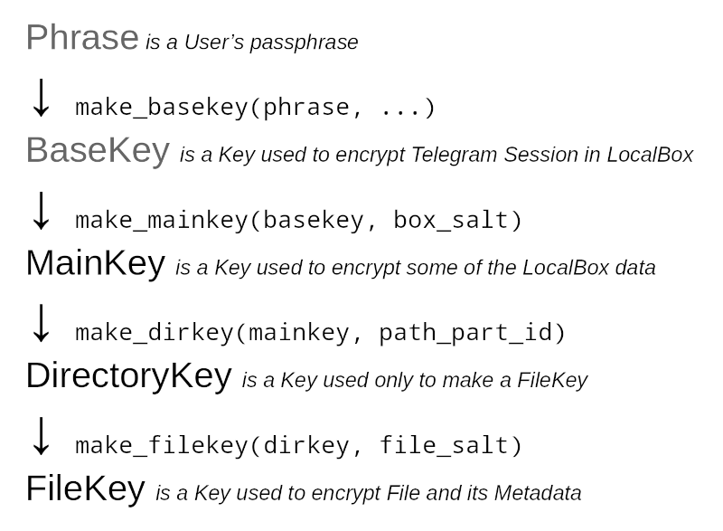
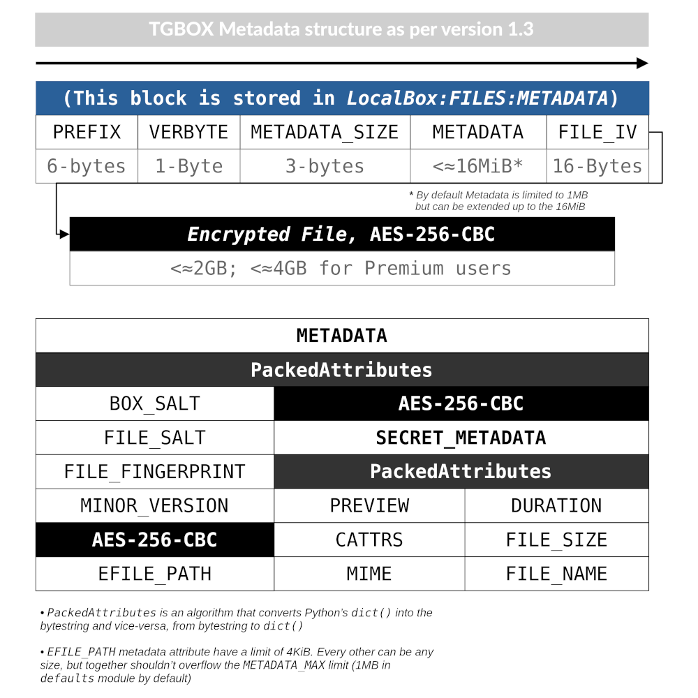

Protocol
========

The TGBOX *Protocol* is a number of rules and algorithms that define how all of things (like *Encryption*, packing *Metadata*, *File sharing* & etc) work. As TGBOX is built around the Telegram messenger, we can call a *TGBOX* as an additional layer which adds more features.

Algorithms used in Encryption
-----------------------------

- For encryption, we use the `AES CBC <https://en.wikipedia.org/wiki/Block_cipher_mode_of_operation#Cipher_block_chaining_(CBC)>`_ with **256 bit** key. First 16 bytes of **any** encrypted by library data is `IV <https://en.wikipedia.org/wiki/Block_cipher_mode_of_operation#Initialization_vector_(IV)>`_;
- For making the ``BaseKey`` (an absolute key that is used to derive all sub-keys) we propose *and* use by default a `Scrypt <https://en.wikipedia.org/wiki/Scrypt>`_ PBKDF;
- As `hash function <https://en.wikipedia.org/wiki/Hash_function>`_, we always use the `SHA256 <https://en.wikipedia.org/wiki/SHA-2>`_;
- For *File* and *Box* :ref:`Sharing` we propose *and* use by default `ECDH <https://en.wikipedia.org/wiki/Diffie%E2%80%93Hellman_key_exchange>`_ on `SECP256k1 <https://en.bitcoin.it/wiki/Secp256k1>`_ curve.

Abstract Box
------------

.. note::
    More detailed in :doc:`remotebox` and :doc:`localbox`

- The *Box* is an object that have *BoxSalt* — 32 (usually random) bytes. With this *Salt* and user *Passphrase* we make *base* encryption key (see :ref:`Encryption keys hierarchy`).

- The *Box* splits into two types, — the *Remote* (is a *Telegram Channel*) and *Local* (is a *SQLite database*). They have a two states, — the *Encrypted* (when *Passphrase* is not presented) and *Decrypted*.

- The *RemoteBox* store encrypted Files and their Metadata. *LocalBox* store Metadata and Directories (see details in :doc:`localbox`).

- The *LocalBox* can be fully restored from the *RemoteBox* if you have a decryption key (but this can take a little of time if you uploaded a big amount of files);

- The *Box* can be shared with multiply users.

Abstract Box file
-----------------

.. note::
    More details in :doc:`remotebox` and :doc:`localbox`

- An abstract *Box file* is an object that have *FileSalt* — 32 random bytes. With this *Salt* and user *Passphrase* -> ``BaseKey`` -> ``MainKey`` we **used** to make a *file* encryption key. Started from the version 1.3 we make a *file* encryption key with the ``DirectoryKey`` and *FileSalt*. See details in :ref:`Encryption keys hierarchy`;

- The *Box file* has *Metadata* (see :ref:`Box file & its Metadata`);

- The *Box file* splits into two types, — the *Remote* (stored in a *RemoteBox*) and *Local* (metadata of the *Remote* file stored in a *LocalBox*). They have a two states, — the *Encrypted* (when ``FileKey`` is not presented) and *Decrypted*;

- The *Box file* can be shared with multiply users without giving key of the whole *Box*; the Requester will only have an access to requested file, and **nothing** more.

Encryption keys hierarchy
-------------------------

The *Phrase* →
++++++++++++++

*Phrase* is a **User's password** or generated by Protocol API **six random mnemonic words**. There is a special class in the TGBOX that can make a *phrase*: :class:`tgbox.keys.Phrase`. The *Phrase* is used to only create a :class:`~tgbox.keys.BaseKey`.

The *BaseKey* →
+++++++++++++++

*BaseKey* is a **master Key** that is used to **derive all other sub-keys**. By default, we make this *Key* with a :meth:`tgbox.keys.make_basekey` function, which utilize the `Scrypt <https://en.wikipedia.org/wiki/Scrypt>`_ KDF under the hood and then **hash result** with *SHA256*. The *Scrypt* is configured to require a **1GB of RAM** to make a key, and uses **non unique** salt: :data:`tgbox.defaults.Scrypt`. Expirienced users may want to **change it** to make a brute-force attack impossible, **but should not lost it** (we **do not** store it in any way). Random *Phrase* or secure password should be **just enough** to protect your *Box*. You can wrap any other key in the :class:`~tgbox.keys.BaseKey` class if you want a different implementation.

We also use *BaseKey* to encrypt *Telegram session* (give an **access to the Account**) in the :doc:`localbox`.

The *MainKey* →
+++++++++++++++

.. note::
    You *mostly* will not need to use this and all next *Keys* directly, because it's a Protocol business.

*MainKey* is a *Key* that is used to **derive a directory keys** and to encrypt some of the :doc:`localbox` data. When we start a "Box making" routine by firstly calling a :func:`~tgbox.api.remote.make_remotebox` function (and then :func:`~tgbox.api.local.make_localbox`), we receive a 32 random bytes, -- the :class:`~tgbox.crypto.BoxSalt`. By concatenating and then hashing by *SHA256* the *MainKey* with *BoxSalt* (:func:`tgbox.keys.make_mainkey`) we make a :class:`~tgbox.keys.MainKey`.

We also use *MainKey* to encrypt some of the data stored in :doc:`remotebox` file *Metadata*.

The *DirectoryKey* →
++++++++++++++++++++

*DirectoryKey* is a *Key* that is used to **derive a file keys**. You may want to read the ":ref:`How does we store file paths`" in :doc:`localbox` firstly to understand it more clearly. In short, every *File* in the *TGBOX* (just as in any OS) has a **file path**. Every *unique* (case-sensitive) file path has it's own *DirectoryKey*, and an every *Part* of the *file path* has it's own ID, that is linked with the parent *Part ID*. To make a :class:`~tgbox.keys.DirectoryKey`, we need to have a *Head Part ID* (ID of last *path part*) and :class:`~tgbox.keys.MainKey`. Firstly, we hash a *MainKey*, then concate hashed *MainKey* with the *Head Part ID*, then hash it again. The final result is a :class:`~tgbox.keys.DirectoryKey`. See :func:`~tgbox.keys.make_dirkey` source code.

In fact, the *DirectoryKey* is **more a deterministic bytes** than a *Key*. It doesn't encrypt anything, but used only to make a *file keys*.

The *FileKey*
+++++++++++++

*FileKey* is a *Key* that is used to **encrypt file and its Metadata**. On :meth:`~tgbox.api.local.DecryptedLocalBox.prepare_file` we receive a 32 random bytes, -- the :class:`~tgbox.crypto.FileSalt`. Just identical to :func:`~tgbox.keys.make_mainkey`, we make a :class:`~tgbox.keys.FileKey` with :func:`~tgbox.keys.make_filekey`. Started from the version *1.3*, to derive a *file keys* we use a :class:`~tgbox.keys.DirectoryKey`. For files that was uploaded *prior* to the *v1.3*, we use a :class:`~tgbox.keys.MainKey`.

Box file & its Metadata
-----------------------

On "uploading some file to the *Box*" routine, the *target* firstly goes through the :meth:`~tgbox.api.local.DecryptedLocalBox.prepare_file` function. In it, we verify that file is
valid and if it is, we construct the *Box file Metadata*, which consist of the next fields:

- **file_salt** *(bytes: required, public)* -- *FileSalt is used for FileKey creation*
- **box_salt** *(bytes: required, public)* -- *BoxSalt is used for MainKey creation*
- **file_fingerprint** *(bytes: v1.1+, public)* -- *A SHA256 of the File's path plus MainKey*
- **efile_path** *(bytes: v1.3+, public)* -- *Encrypted (by MainKey) File's path*
- **minor** *(int: v1.3+, public)* -- *The minor version of the TGBOX protocol*

- **file_name** *(bytes: required, secret)* -- *File's name*
- **file_size** *(int: required, secret)* -- *Pure file's size, no metadata included*
- **duration** *(float: optional, FFMPEG required, secret)* -- *File's duration (if video/audio)*
- **preview** *(bytes: optional, FFMPEG required, secret)* -- *File's preview (if file is media)*
- **mime** *(bytes: required, secret)* -- *File's mime type*

Unpacked *Metadata* also have some fixed bytes at the beginning, which consist of the:
        - **prefix** -- *Bytes to identify the TGBOX encrypted file*
        - **verbyte** -- *Protocol global version as one byte*
        - **metadata_size** -- *Bytesize of the Metadata to unpack*

Packing Algorithm
+++++++++++++++++

To pack a *Key-Value* container we use the simple algorithm, that in *Protocol* is called a :class:`~tgbox.tools.PackedAttributes`. The *packed result* here is combination of
*Key length* plus *Key* plus *Value length* plus *Value* (all *values* should be *bytes*) and so on. We store the Key/Value length in **three bytes**, so the maximum bytelength for each *Key* or *Value* is 16MiB-1.

| In the upper image example, **FF** (is hexed *[int 255]*, as well as *Key length* & *Value length*) is a *Magic number* that identify a *PackedAttributes* bytestring. The **000005** is a *Key length*, the next is a *Key*, which is "*field*". So, we slice the first three bytes after *Magic number*, get a *Key length*, then we slice a *Key length*, get a *Key*. After *Key* there should be the next three bytes that represent a *Value length*. We make the same operation as with *Key* and receive a *Value*, which is "*data*". Repeat this until packed string *is not empty*.

.. code-block:: python

    from tgbox.tools import PackedAttributes

    pattrs = PackedAttributes.pack(field=b'data', x=b'test')
    # b'\xff\x00\x00\x05field\x00\x00\x04data\x00\x00\x01x\x00\x00\x04test'

    print(PackedAttributes.unpack(pattrs))
    # {'field': b'data', 'x': b'test'}

Metadata in depth
+++++++++++++++++

On this schema:
    - Only *Metadata* keys shown;
    - The *efile_path* field is encrypted with *MainKey*. It is now a part of public *Metadata*, so we can decrypt it, make a *DirectoryKey* and then *FileKey*;
    - The *secret_metadata* field is encrypted with *FileKey*.

.. note::
   *Metadata* is **always** placed in the start of the *Box file*.

Describing in Code
^^^^^^^^^^^^^^^^^^

This code example will decrypt and parse example file that was uploaded in my public *Box* **with disclosed MainKey**. If you want to test a file from your *Box*, then you will need to **make** a *MainKey*.

.. admonition:: How to make a *MainKey* from the *Phrase*
    :class: dropdown

    .. code-block:: python

        import tgbox, base64

        # Copy BoxSalt from your Telegram Box Channel description
        box_salt = '0000000000000000000000000000000000000000000='
        box_salt = tgbox.crypto.BoxSalt(base64.urlsafe_b64decode(box_salt))

        phrase = tgbox.keys.Phrase('very_secret_password')
        basekey = tgbox.keys.make_basekey(phrase)

        # You can use this MainKey & one of the File
        # from your Box with the example code below
        MAINKEY = tgbox.keys.make_mainkey(basekey, box_salt)

    .. warning::
        **Never** disclose *Phrase* or *BaseKey*! Share *MainKey* only via *ShareKey* and only if you want to share a *Box* with someone!

.. code-block:: python

        import pathlib, tgbox

        # The MainKey of the example Box is already disclosed, see t.me/nontgbox_non
        MAINKEY = tgbox.keys.Key.decode('MbxTyN4T2hzq4sb90YSfWB4uFtL03aIJjiITNUyTqdoU=')
        # You need to download the encrypted example Box file: t.me/nontgbox_non/89
        BOXFILE = open('LJNbud8SoQGlzZGRk6RkVbwT3eXC7hAaXZE6AeRView=','rb').read()

        # There is PREFIX, VERBYTE and METADATA_SIZE which is always
        # fixed in the first 10 bytes of the encrypted by Protocol file
        FIXED_METADATA = BOXFILE[:10] # b'\x00TGBOX\x01\x00\x01}'

        PREFIX = FIXED_METADATA[:6] # b'\x00TGBOX' (is signature)
        VERBYTE = FIXED_METADATA[6:7] # b'\x01' (major Protocol version)

        METADATA_SIZE = FIXED_METADATA[7:] # b'\x00\x01}' (size of the Metadata)
        # Convert the bytes METADATA_SIZE to the integer type
        METADATA_SIZE = tgbox.tools.bytes_to_int(METADATA_SIZE) # 381

        # Actual Metadata goes after Fixed, so slice from 10 to METADATA_SIZE+10 (Fixed Metadata bytesize)
        METADATA = BOXFILE[10:METADATA_SIZE+10] # b"\xff\x00\x00\x08box_salt\x00\x00 \x..>
        UNPACKED_METADATA = tgbox.tools.PackedAttributes.unpack(METADATA) # {'box_salt': b'\xd3M4\xd3M4\xd3M4\xd3M4..>

        # To decrypt the Secret Metadata we need to make a DirectoryKey, and
        # then the FileKey, so firstly we will decrypt the efile_path and
        # make a DirectoryKey from the last Path Part ID
        file_path = tgbox.crypto.AESwState(MAINKEY).decrypt(UNPACKED_METADATA['efile_path'])
        file_path = pathlib.Path(file_path.decode()) # '/home/tgbox/v1.3', ppart_id_generator require Path object

        for path_part in tgbox.tools.ppart_id_generator(file_path, MAINKEY):
            part_id = path_part[2] # ppart_id_generator yields tuple

        # Started from v1.3 we make FileKeys from DirectoryKey, not MainKey
        dirkey = tgbox.keys.make_dirkey(MAINKEY, part_id)
        # We make a FileKey from DirectoryKey and FileSalt (always in pub.Metadata)
        filekey = tgbox.keys.make_filekey(dirkey, UNPACKED_METADATA['file_salt'])

        secret_metadata = tgbox.crypto.AESwState(filekey).decrypt(UNPACKED_METADATA['secret_metadata']) # b'\xff\x00\x00\x07prev..>
        secret_metadata = tgbox.tools.PackedAttributes.unpack(secret_metadata) # {'preview': b'', 'dur..>

        print(secret_metadata)

.. tip::
   The next code blocks can be inserted in the end of the code above

.. admonition:: Prove that *Metadata* encryption is properly implemented
    :class: dropdown

    .. code-block:: python

        from subprocess import run as subprocess_run

        # First 16 bytes of any encrypted by Protocol data is IV of AES CBC (256bit)
        secret_metadata_iv = UNPACKED_METADATA['secret_metadata'][:16]

        # Write the encrypted Secret Metadata (without IV!) to file
        open('LJNbud_sm','wb').write(UNPACKED_METADATA['secret_metadata'][16:])

        # You can < print(' '.join(subprocess_command)) > to get a CMD command
        subprocess_command = ['openssl', 'aes-256-cbc', '-d', '-in', 'LJNbud_sm',
            '-K', filekey.hex(), '-iv', secret_metadata_iv.hex()]

        sp_result = subprocess_run(subprocess_command, capture_output=True)
        print(sp_result.stdout) # b'\xff\x00\x00\x07prev..>

        # Compare the Unpacked Secret Metadata that was decrypted within Protocol code
        # with the Unpacked Secret Metadata that was decrypted within OpenSSL 1.1.1n
        print(tgbox.tools.PackedAttributes.unpack(sp_result.stdout) == secret_metadata) # True

.. code-block:: python

        # = Decrypt actual File ============================================ #

        # Actual encrypted File (original file that was uploaded by user)
        # position is FIXED_METADATA size (10, -- PREFIX + VERBYTE +
        # METADATA_SIZE) plus METADATA_SIZE (integer)
        encrypted_file_pos = 10 + METADATA_SIZE # 391

        # encrypted_file includes IV as first 16 bytes
        encrypted_file = BOXFILE[encrypted_file_pos:]

        # Just similar to Secret Metadata, we decrypt File with FileKey
        decrypted_file = tgbox.crypto.AESwState(filekey).decrypt(encrypted_file)

        # I made & uploaded an example text File, so we can print it
        print(decrypted_file) # b'This file will be deconstructed in v1.3 docs! :)\n'

.. admonition:: Prove that *File* encryption is properly implemented
    :class: dropdown

    .. code-block:: python

        from subprocess import run as subprocess_run

        # First 16 bytes of any encrypted by Protocol data is IV of AES CBC (256bit)
        encrypted_file_iv = encrypted_file[:16]

        # Write the encrypted user File (without IV!) to file
        open('LJNbud_ef','wb').write(encrypted_file[16:])

        # You can < print(' '.join(subprocess_command)) > to get a CMD command
        subprocess_command = ['openssl', 'aes-256-cbc', '-d', '-in', 'LJNbud_ef',
            '-K', filekey.hex(), '-iv', encrypted_file_iv.hex()]

        sp_result = subprocess_run(subprocess_command, capture_output=True)
        print(sp_result.stdout) # b'This file will be deconstructed in v1.3 docs! :)\n'

File Storage
------------

When user "adds some file to the *Box*", we:

1. Check it for validity, make Metadata and store it in :class:`~tgbox.api.utils.PreparedFile` object;
2. Take :class:`~tgbox.api.utils.PreparedFile`, concatenate *Metadata* with encrypted *File* and upload it to the :doc:`remotebox`;
3. Store *Metadata* plus *File* `IV <https://en.wikipedia.org/wiki/Block_cipher_mode_of_operation#Initialization_vector_(IV)>`_ alongside with other data in the *SQLite Database* (or the :doc:`localbox`).

We store user's *Box file* (*Metadata* plus *Encrypted user File*) in the :doc:`remotebox`. Locally, in the :doc:`localbox`, we store only *Metadata* (and some other data that can help us to operate faster on local storage). You may refer to :doc:`localbox` as ":doc:`remotebox` cache". It's always better to use *Local* for gathering info about *Files*.

Updating Files
++++++++++++++

Although the *Telegram messenger* doesn't allow us to update a *parts* of already uploaded *Files*, there is some methods in the *Protocol* that can help you in some scenarios.

Updating Metadata
^^^^^^^^^^^^^^^^^

You can update some *Metadata attributes* of the *Box File* **after** it was uploaded. For example, you can change a *File name* of *File path* (last will change *Directory* too, like "move to folder" operation) with :meth:`~tgbox.api.remote.DecryptedRemoteBoxFile.update_metadata` on *RemoteBox File* and then :meth:`~tgbox.api.local.DecryptedLocalBoxFile.refresh_metadata` on a *LocalBox File* with the same *ID*. Please note that we **can not** partially update already uploaded to Telegram *File*, so your updated *Metadata attributes* will be stored in **encrypted** and encoded **form** in the *File caption*, which have it's own limits (~2KB/*~4KB Premium*).

Re-uploading File
^^^^^^^^^^^^^^^^^

You can fully re-upload (and so *edit*) already existen *Box File*. This can be useful for small files that constantly change its contents. To do so, you should *prepare* a new file with :meth:`~tgbox.api.local.DecryptedLocalBox.prepare_file`, get a :class:`~tgbox.api.remote.DecryptedRemoteBoxFile` that you want to change and call :meth:`~tgbox.api.remote.DecryptedRemoteBox.update_file` on :class:`~tgbox.api.remote.DecryptedRemoteBox`. No interaction with *LocalBox* is needed, as :class:`tgbox.api.utils.PreparedFile` contains :class:`~tgbox.api.local.DecryptedLocalBox` as object and will be updated automatically.

Sharing
-------

The *Protocol* fully supports *File* or *Box* sharing with other people.

Sharing *Box file*
++++++++++++++++++

To share a *Box file* we need to extract a *FileKey* and send it to *Requester* alongside with the *Box file* itself. We can share a *Key* as-is, but this is **not secure**. Instead, we will establish a secure canal via *asymmetric cryptography* (with `ECDH <https://en.wikipedia.org/wiki/Diffie%E2%80%93Hellman_key_exchange>`_).

1. *Alice* forwards file from her :doc:`remotebox` *Channel* to *Bob*;
2. *Bob* forwards received file to his :doc:`remotebox` *Channel*;
3. *B* gets :class:`~tgbox.api.remote.EncryptedRemoteBoxFile` and calls :func:`~tgbox.api.remote.EncryptedRemoteBoxFile.get_requestkey` on it, obtains :class:`~tgbox.keys.RequestKey`;
4. *A* receives :class:`~tgbox.keys.RequestKey` from *B* *(can be shared via insecure canals)*;
5. *A* makes :class:`~tgbox.keys.ShareKey` with *B*'s :class:`~tgbox.keys.RequestKey` and sends it to *B* *(can be shared via insecure canals)*;
6. *B* makes :class:`~tgbox.keys.ImportKey` with *A*'s :class:`~tgbox.keys.ShareKey`, decrypts :class:`~tgbox.api.remote.EncryptedRemoteBoxFile` and imports it.

In more low-level
^^^^^^^^^^^^^^^^^

- **0. Bob makes his own Box**

  To import other's *Box file*, *Bob* will need to create his own *Box*

- **1. Alice forwards Box file to Bob**

  *Alice* will need to forward *Box file* from her :doc:`remotebox` to chat with *Bob*.   This can be done within *Telegram* or by using a :class:`~tgbox.api.utils.TelegramClient` object from the ``*RemoteBox`` (see :class:`~tgbox.api.remote.EncryptedRemoteBox.tc`)

- **2. Bob forwards Box file to his Box**

  *Bob* will need to forward *Box file* from chat with *Alice* to his :doc:`remotebox`. Then, obtain it as :class:`~tgbox.api.remote.EncryptedRemoteBoxFile` (i.e. with :meth:`~tgbox.api.remote.EncryptedRemoteBox.get_file` or with :meth:`~tgbox.api.remote.EncryptedRemoteBox.search_file`)

- **3. Bob makes RequestKey**

  After obtaining a :class:`~tgbox.api.remote.EncryptedRemoteBoxFile` of *Alice* as object, *Bob* will need to call a :func:`~tgbox.api.remote.EncryptedRemoteBoxFile.get_requestkey` method on it, which will result in :class:`~tgbox.keys.RequestKey`. Under the hood, this method will call a :func:`~tgbox.keys.make_requestkey` function. In it, *Bob* will make a *EC* **private key** on *SECP256k1* from the ``sha256(b_mainkey + file_salt)``, and corresponding **public key** of private key in a `compressed form <https://medium.com/asecuritysite-when-bob-met-alice/02-03-or-04-so-what-are-compressed-and-uncompressed-public-keys-6abcb57efeb6>`_ is a :class:`~tgbox.keys.RequestKey`.

- **4. Alice receives RequestKey from Bob**

  Can be done within Telegram, TGBOX (:class:`~tgbox.api.remote.EncryptedRemoteBox.tc`) or **any** other insecure communication canal.

- **5. Alice makes ShareKey with RequestKey of Bob and sends it**

  1. *A* creates her *EC* **private key** on *SECP256k1* from the ``sha256(a_mainkey + sha256(file_salt + b_requestkey))``. After this, she will extract **public key** from *B*'s :class:`~tgbox.keys.RequestKey` and will make a **shared 32 byte-secret** with ``ECDH(a_privkey, b_pubkey{requestkey}, secp256k1)``. **Shared secret is additionaly hashed with SHA256**. Hashed shared secret is AES-CBC key for :class:`~tgbox.keys.FileKey` encryption;

  2. *A* make SHA256 hash from *B*'s :class:`~tgbox.keys.RequestKey` and take
     first 16 bytes from result, this is AES-CBC **IV**.

  3. *A* encrypts her :class:`~tgbox.keys.FileKey` with *hashed shared secret* and IV. Let's call
     result as *eFileKey*. After this she constructs :class:`~tgbox.keys.ShareKey` as
     follows: ``ShareKey(efilekey + a_pubkey)``. We don't concat
     IV to the :class:`~tgbox.keys.ShareKey` because *B* can extract it from his :class:`~tgbox.keys.RequestKey`.

- **6. Bob makes ImportKey with ShareKey of Alice & decrypts File**

  *Bob* will repeat a process of making a :class:`~tgbox.keys.RequestKey` in the
  :func:`~tgbox.keys.make_importkey` function. :class:`~tgbox.keys.ShareKey` consist of
  *encrypted filekey* and *public key of Alice*. On making :class:`~tgbox.keys.RequestKey` *Bob* will make his own **private key**, so he can easily get the same *shared secret* with ECDH as *Alice* and decrypt the *encrypted filekey* to obtain :class:`~tgbox.keys.ImportKey` (which is actually a :class:`~tgbox.keys.FileKey`). ``ECDH(b_privkey, a_pubkey{requestkey}, secp256k1) -> SHA256 -> {decrypt efilekey}``

- **7. Bob imports decrypted EncryptedRemoteBoxFile**

  *Bob* will call :meth:`~tgbox.api.remote.EncryptedRemoteBoxFile.decrypt` with resulted :class:`~tgbox.keys.ImportKey` from step *6.* and receive :meth:`~tgbox.api.remote.DecryptedRemoteBoxFile`. To store information about this file in the *LocalBox*, *Bob* will need to call :meth:`~tgbox.api.DecryptedLocalBox.import_file` method. This will store a :class:`~tgbox.keys.FileKey` in encrypted form in *LocalBox* of *Bob* so he can always access imported file of *Alice*.

.. note::
   We store file keys of **other** people **only** in your *LocalBox*. You will easily retrieve all information about **your** files in *Remote* if corresponding to it *Local* will be lost (you can always make a *LocalBox* from *RemoteBox*), however, it's will be **impossible** to decrypt all *imported files*, and you will need to request a keys for them again.

Sharing *Box directory*
+++++++++++++++++++++++

.. note::
   This chapter is only for files that was uploaded from *version 1.3+*!

If you want to share many files at once, with previous approach (:ref:`Sharing *Box file*`) you will be need to make a separate :class:`~tgbox.keys.ShareKey` for each target file. Started from *version 1.3* now it's possible to share a bunch of files **per one request**. To do so, target *Box files* should be linked to one *abstract file path* in your *Box*. For example, you can share all files that have a */home/user/Pictures* path (we call it *Directory*) with **only one** :class:`~tgbox.keys.ShareKey`.

.. tip::
   More details about implementation of *abstract Directories* you can find in :doc:`localbox`.

To share a *Box directory* we need to extract a *DirectoryKey* and send it to *Requester* alongside with the *Box files* from target *Directory*. We can share a *Key* as-is, but this is **not secure**. Instead, we will establish a secure canal via *asymmetric cryptography* (with `ECDH <https://en.wikipedia.org/wiki/Diffie%E2%80%93Hellman_key_exchange>`_).

1. *Alice* forwards files from *Directory* from her :doc:`remotebox` *Channel* to *Bob*;
2. *Bob* forwards received files to his :doc:`remotebox` *Channel*;
3. *B* gets last received :class:`~tgbox.api.remote.EncryptedRemoteBoxFile` and calls :func:`~tgbox.api.remote.EncryptedRemoteBoxFile.get_requestkey` on it, obtains :class:`~tgbox.keys.RequestKey`;
4. *A* receives :class:`~tgbox.keys.RequestKey` from *B* *(can be shared via insecure canals)*;
5. *A* makes :class:`~tgbox.keys.ShareKey` of :class:`~tgbox.keys.DirectoryKey` with *B*'s :class:`~tgbox.keys.RequestKey` and sends it to *B* *(can be shared via insecure canals)*;
6. *B* makes :class:`~tgbox.keys.ImportKey` with *A*'s :class:`~tgbox.keys.ShareKey`, decrypts each received :class:`~tgbox.api.remote.EncryptedRemoteBoxFile` and imports them.

In more low-level
^^^^^^^^^^^^^^^^^

- **0. Bob makes his own Box**

  To import other's *Box file*, *Bob* will need to create his own *Box*

- **1. Alice forwards Box files of Directory to Bob**

  To get each file that is linked to some *Directory*, *Alice* can use a :meth:`~tgbox.api.local.DecryptedLocalBox.search_file` with :class:`~tgbox.tools.SearchFilter` that contains a ``file_path``. Most efficiently, *Alice* can get a :class:`~tgbox.api.local.DecryptedLocalBoxDirectory` object with :meth:`~tgbox.api.local.DecryptedLocalBox.get_directory` and iterate over it via :meth:`~tgbox.api.local.DecryptedLocalBoxDirectory.iterdir`. While iterating, *Alice* can use a :meth:`~tgbox.api.remote.EncryptedRemoteBox.tc.forward_messages` method from *RemoteBox Telegram Client* (:meth:`~tgbox.api.remote.EncryptedRemoteBox.tc`).

- **2. Bob forwards Box files of Directory to his Box**

  This step can be omitted if in *1.* *Alice* will forward directly to the *Box* of *Bob*. To do so, *Bob* should add *Alice* to his *RemoteBox Channel* and grant her with permission to *Post messages*. Otherwise, *Bob* will need to forward each file from *Alice* within Telegram or find a way to do it programmatically with :class:`~tgbox.api.remote.EncryptedRemoteBox.tc`.

- **3. Bob makes RequestKey to last file**

  After forwarding every :class:`~tgbox.api.remote.EncryptedRemoteBoxFile` from *Alice*, *Bob* should obtain last forwarded *Box file* as object and call a :func:`~tgbox.api.remote.EncryptedRemoteBoxFile.get_requestkey` method on it, which will result in :class:`~tgbox.keys.RequestKey`. Under the hood, this method will call a :func:`~tgbox.keys.make_requestkey` function. In it, *Bob* will make a *EC* **private key** on *SECP256k1* from the ``sha256(b_mainkey + file_salt)``, and corresponding **public key** of private key in a `compressed form <https://medium.com/asecuritysite-when-bob-met-alice/02-03-or-04-so-what-are-compressed-and-uncompressed-public-keys-6abcb57efeb6>`_ is a :class:`~tgbox.keys.RequestKey`.

- **4. Alice receives RequestKey from Bob**

  Can be done within Telegram, TGBOX (:class:`~tgbox.api.remote.EncryptedRemoteBox.tc`) or **any** other insecure communication canal.

- **5. Alice makes ShareKey with RequestKey of Bob and sends it**

  1. *A* creates her *EC* **private key** on *SECP256k1* from the ``sha256(a_mainkey + sha256(file_salt{of last file} + b_requestkey))``. After this, she will extract **public key** from *B*'s :class:`~tgbox.keys.RequestKey` and will make a **shared 32 byte-secret** with ``ECDH(a_privkey, b_pubkey{requestkey}, secp256k1)``. **Shared secret is additionaly hashed with SHA256**. Hashed shared secret is AES-CBC key for :class:`~tgbox.keys.DirectoryKey` encryption. :class:`~tgbox.keys.DirectoryKey` can be easily obtained from :attr:`~tgbox.api.local.DecryptedLocalBoxFile.dirkey`;

  2. *A* make SHA256 hash from *B*'s :class:`~tgbox.keys.RequestKey` and take
     first 16 bytes from result, this is AES-CBC **IV**.

  3. *A* encrypts her :class:`~tgbox.keys.DirectoryKey` with *hashed shared secret* and IV. Let's call result as *eDirectoryKey*. After this she constructs :class:`~tgbox.keys.ShareKey` as follows: ``ShareKey(e_directorykey + a_pubkey)``. We don't concat IV to the :class:`~tgbox.keys.ShareKey` because *B* can extract it from his :class:`~tgbox.keys.RequestKey`.

- **6. Bob makes ImportKey with ShareKey of Alice & decrypts Files**

  *Bob* will repeat a process of making a :class:`~tgbox.keys.RequestKey` in the
  :func:`~tgbox.keys.make_importkey` function. :class:`~tgbox.keys.ShareKey` consist of
  *encrypted filekey* and *public key of Alice*. On making :class:`~tgbox.keys.RequestKey` *Bob* will make his own **private key**, so he can easily get the same *shared secret* with ECDH as *Alice* and decrypt the *encrypted directorykey* to obtain :class:`~tgbox.keys.ImportKey` (which is actually a :class:`~tgbox.keys.DirectoryKey`). ``ECDH(b_privkey, a_pubkey{requestkey}, secp256k1) -> SHA256 -> {decrypt edirectorykey}``

- **7. Bob imports decrypted EncryptedRemoteBoxFile**

  *Bob* will call :meth:`~tgbox.api.remote.EncryptedRemoteBoxFile.decrypt` with resulted :class:`~tgbox.keys.ImportKey` from step *6.* on each file of *Alice* and will receive :meth:`~tgbox.api.remote.DecryptedRemoteBoxFile` objects. To store information about this files in the *LocalBox*, *Bob* will need to call :meth:`~tgbox.api.DecryptedLocalBox.import_file` method on each decrypted file. This will make & store a :class:`~tgbox.keys.FileKey` in encrypted form in *LocalBox* of *Bob* so he can always access imported files of *Alice*.

.. note::
   We store file keys of **other** people **only** in your *LocalBox*. You will easily retrieve all information about **your** files in *Remote* if corresponding to it *Local* will be lost (you can always make a *LocalBox* from *RemoteBox*), however, it's will be **impossible** to decrypt all *imported files*, and you will need to request a keys for them again.

Sharing *Box*
+++++++++++++

To share a *Box* we need to extract a *MainKey* and send it to *Requester* alongside with adding *Requester* to *Box Channel*. We can share a *Key* as-is, but this is **not secure**. Instead, we will establish a secure canal via *asymmetric cryptography* (with `ECDH <https://en.wikipedia.org/wiki/Diffie%E2%80%93Hellman_key_exchange>`_).

1. *Alice* make & send invite link of her *RemoteBox Channel* to *Bob*;
2. *Bob* joins *RemoteBox Channel* of *Alice*;
3. *B* gets :class:`~tgbox.api.remote.EncryptedRemoteBox` object and calls :func:`~tgbox.api.remote.EncryptedRemoteBox.get_requestkey` on it, obtains :class:`~tgbox.keys.RequestKey`;
4. *A* receives :class:`~tgbox.keys.RequestKey` from *B* *(can be shared via insecure canals)*;
5. *A* makes :class:`~tgbox.keys.ShareKey` with *B*'s :class:`~tgbox.keys.RequestKey` and sends it to *B* *(can be shared via insecure canals)*;
6. *B* makes :class:`~tgbox.keys.ImportKey` with *A*'s :class:`~tgbox.keys.ShareKey`, decrypts :class:`~tgbox.api.remote.EncryptedRemoteBox` and clones it.

In more low-level
^^^^^^^^^^^^^^^^^

- **0. Bob makes BaseKey**

  To clone *RemoteBox* of *Alice*, *Bob* firstly should create :class:`~tgbox.keys.BaseKey` for it. Proposed way is to use a :func:`~tgbox.keys.make_basekey` function.

- **1. Alice invites Bob to her RemoteBox channel**

  Can be done within Telegram or TGBOX (:class:`~tgbox.api.remote.EncryptedRemoteBox.tc`).

- **2. Bob gets EncryptedRemoteBox and calls get_requestkey on it**

  Every *RemoteBox* has :class:`~tgbox.crypto.BoxSalt`. The *RemoteBox* store it in *Channel description*, encoded by `Url Safe Base64 <https://docs.python.org/3/library/base64.html#base64.urlsafe_b64encode>`_. From concated :class:`~tgbox.crypto.BoxSalt` with new :class:`~tgbox.keys.BaseKey` of *B* we make a `SHA256 hash <https://en.wikipedia.org/wiki/SHA-2#Test_vectors>`_. This hash acts as *private key* for ECDH on `secp256k1 curve <https://en.bitcoin.it/wiki/Secp256k1>`_. We create *public key* from this *private key*, `compress it <https://medium.com/asecuritysite-when-bob-met-alice/02-03-or-04-so-what-are-compressed-and-uncompressed-public-keys-6abcb57efeb6>`_, and return (by :meth:`~tgbox.api.EncryptedRemoteBox.get_requestkey`) ``RequestKey(compressed_pubkey)``. Generally, :class:`~tgbox.keys.RequestKey` is a **compressed** EC *public key*.

- **3. Alice receives RequestKey from Bob**

  Can be done within Telegram or TGBOX (:class:`~tgbox.api.remote.EncryptedRemoteBox.tc`).

- **4. Alice makes ShareKey with Bob's RequestKey and sends it**

  1. *A* creates her own *private key* similarly to *B*, with the difference only in the *Salt*. While *B* makes a *private key* and then *public key* (= :class:`~tgbox.keys.RequestKey`) from the :class:`~tgbox.keys.BaseKey` concated with the :class:`~tgbox.keys.BoxSalt`, *Alice* makes *private key* from the ``sha256(a_mainkey + sha256(box_salt + b_requestkey))``. After this, she extracts *public key* from :class:`~tgbox.keys.RequestKey` of *B* and makes a **shared 32 byte-secret** with ``ECDH(a_privkey, b_pubkey{requestkey}, secp256k1)``. **Shared secret is additionaly hashed with SHA256**. Hashed shared secret is AES-CBC key for :class:`~tgbox.keys.MainKey` encryption;

  2. *A* make SHA256 hash from *B*'s :class:`~tgbox.keys.RequestKey` and take
     first 16 bytes from result, this is AES-CBC **IV**.

  3. *A* encrypts her :class:`~tgbox.keys.MainKey` with *hashed shared secret* and IV. Let's call result as *eMainKey*. After this she constructs :class:`~tgbox.keys.ShareKey` as follows: ``ShareKey(emainkey + a_pubkey)``. We don't concat IV to the :class:`~tgbox.keys.ShareKey` because *B* can extract it from his :class:`~tgbox.keys.RequestKey`.

- **5. Bob makes ImportKey with ShareKey of Alice & decrypts RemoteBox**

  *Bob* will repeat a process of making a :class:`~tgbox.keys.RequestKey` in the
  :func:`~tgbox.keys.make_importkey` function. :class:`~tgbox.keys.ShareKey` consist of
  *encrypted mainkey* and *public key of Alice*. On making :class:`~tgbox.keys.RequestKey` *Bob* will make his own **private key**, so he can easily get the same *shared secret* with ECDH as *Alice* and decrypt the *encrypted mainkey* to obtain :class:`~tgbox.keys.ImportKey` (which is actually a :class:`~tgbox.keys.MainKey`). ``ECDH(b_privkey, a_pubkey{requestkey}, secp256k1) -> SHA256 -> {decrypt emainkey}``

- **6. Bob imports decrypted EncryptedRemoteBoxFile**

  *Bob* will call :meth:`~tgbox.api.remote.EncryptedRemoteBox.decrypt` with resulted :class:`~tgbox.keys.ImportKey` from step *5.* and receive :meth:`~tgbox.api.remote.DecryptedRemoteBox`. To save this *Key* and all information about *RemoteBox*, *Bob* will need to **clone it** by using :func:`tgbox.api.remote.clone_remotebox` function, which result is :class:`~tgbox.api.local.DecryptedLocalBox`. Now *Bob* can access and download any file that was uploaded by *Alice*, and also make its own uploads (if permission is granted).

.. note::
   Taking into account our example with *Alice* and *Bob*, *Alice* will also need to grant *Bob* with administrator privileges (at least *Post messages*) in her *RemoteBox Channel* so he can upload its own files. Sure, if *Alice* will want to.

.. warning::
   - By sharing a whole *Box* (a *MainKey* of it) you grant a **full read-only permission** to *Requester*. **Never** do this if you don't trust *Requester*!
   - There is **plenty** of inbuilt in Telegram *Channel* permissions for every unique *Admin*. You can allow to Upload(/Post) but **forbid to Edit/Delete** files of other's.

Synchronization
+++++++++++++++

Taking into account our example in :ref:`Sharing *Box*`, if any of the *Box* user will *push* new files to *RemoteBox*, then other *Box* users **should synchronize it**. For example, if *Alice* will grant *Adming privileges* to *Bob* and he will *push* own file to *Remote*, the *LocalBox* of *Alice* **will not** know about this. To update a *LocalBox* with new information, *Alice* will use a :meth:`~tgbox.api.local.DecryptedLocalBox.sync` method of :class:`~tgbox.api.local.DecryptedLocalBox`.

Fast Synchronization
^^^^^^^^^^^^^^^^^^^^

**Fast Synchronization** is a process in which we check the *Telegram Channel* `Admin Log <https://core.telegram.org/api/recent-actions>`_ for *Box* updates (stored within 48 hours). It's fast, efficient and default for :meth:`~tgbox.api.local.DecryptedLocalBox.sync`. It's available **for Admins only** (Admin with *Zero Rights* will **have** access to *Admin Log*). As number of *Admins* per *Telegram Channel* is limited, some will prefer to use a *Deep Sync*.

Deep Synchronization
^^^^^^^^^^^^^^^^^^^^

**Deep Synchronization** is a process in which we iterate over :doc:`remotebox` and **compare each file** with those from :doc:`localbox`. If some *File* is presented in *Remote* but not presented in *Local*, -- it will be imported. If some *File* is presented in *Local* but not presented in *Remote*, then it will be **removed** from *Local*. The *Deep Sync* is pretty fast even with *Box* that have a thousands of *Files*, however, may make a many of unnecessary requests. In contrary to *Fast Sync*, the *Deep Sync* is not limited in 48 hours time span. Moreover, you can set a *Start From ID* parameter if you need to *sync* only most recent *Files*. *Deep Sync* can be enabled by the ``deep=True`` flag in the :meth:`~tgbox.api.local.DecryptedLocalBox.sync` method.

.. note::
   Both *Sync* methods catch *File* (and *Metadata*) updates, import new *Files* & remove *Files* that no more exist in the *RemoteBox*. You can specify a *Progress Calback* and track a progess of *Sync* process.

Versioning
----------

The TGBOX will try to follow the well known `Semantic Versioning <https://semver.org/>`_. Development cycle:

1. We will increment *Minor Version* and push all updates to the default ``indev`` branch
2. While developing, we will increment the alpha/beta tags of Version and make pre-release
3. When all updates will be commited & tested, we will make a *branch of Version*

In future, we will push patches to the *Version* branch and make release of it.

- You can get a version from :mod:`tgbox.version` module, and *Minor Version* as integer from :const:`tgbox.defaults.MINOR_VERSION` constant.

- The :const:`~tgbox.defaults.VERBYTE` define compatibility, it is the *major version*. While it's not incremented, all new updates **MUST** support previous file formats, methods, etc. Except *Version byte* there can be lower versions, like ``v1.1``, ``v1.1.1``, etc. Verbyte= ``b'\x00'`` and Verbyte= ``b'\x01'`` **shouldn't** be compatible, otherwise we can use a lower version (*minor*/*patch*), i.e ``v1.1``. Typically we will update ``VERBYTE`` only on the breaking API changes.
