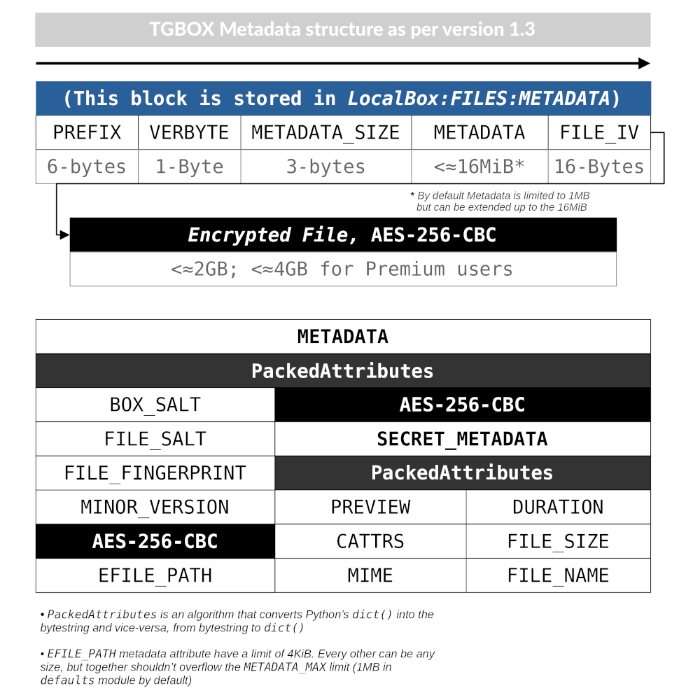

RemoteBox
=========

The *RemoteBox* is a place where we store encrypted files. It's a Telegram ``Channel``, that have encoded by url safe Base64 *BoxSalt* in the description. By default, all created by API channels will have ``"tgbox: "`` prefix in the name.

RemoteBoxFile
-------------

The ``EncryptedRemoteBoxFile`` may be reffered as new file format, with own ``RemoteBoxFileMetadata``. As per ``0-1`` Version, schema looks like follows:

The *Prefix*, *Verbyte*, *BoxSalt*, *FileSalt* and *Navbytes* is always fixed in first ``103`` bytes of ``EncryptedRemoteBoxFile``. To decrypt file and its attributes, we need to go through some steps:

1. If not ``MainKey``, take ``BoxSalt``, user's ``Phrase`` and make it;
2. Take ``FileSalt`` and make ``FileKey`` with ``MainKey``;
3. Decrypt *Navbytes* with ``FileKey``, receive *FileData* & *Preview* length;
4. Download bytes from ``103`` to the ``FileDataLen``, receive *FileData*;
5. Download bytes from ``103 + FileDataLen`` to the ``PreviewLen``, receive *Preview*;
6. Decrypt *FileData* with ``FileKey``, receive *File attributes*;
7. Download bytes from ``103 + FileDataLen + PreviewLen``, receive *File*;
8. Decrypt *File* with ``FileKey``, receive *Decrypted file*.

.. note::
    - We decrypt attributes with variable size in *FileData* (i.e *Comment*), similarly to the *Preview* in the five step.
    - We **always** encrypt *Folder* with ``MainKey``.
    - Max bytesize of every *Metadata* element defined in the ``constants`` module.

Extra
-----

- *RemoteBox* (``Channel``) **doesn't** store any keys, so you may leave it public if you want. But beware, if you're using weak ``Phrase``, then you can still be brute-forced.
- ``EncryptedRemoteBoxFile`` **can** be decrypted outside of *RemoteBox*, as standalone file.
- *RemoteBox* store all information that store :doc:`localbox`.
